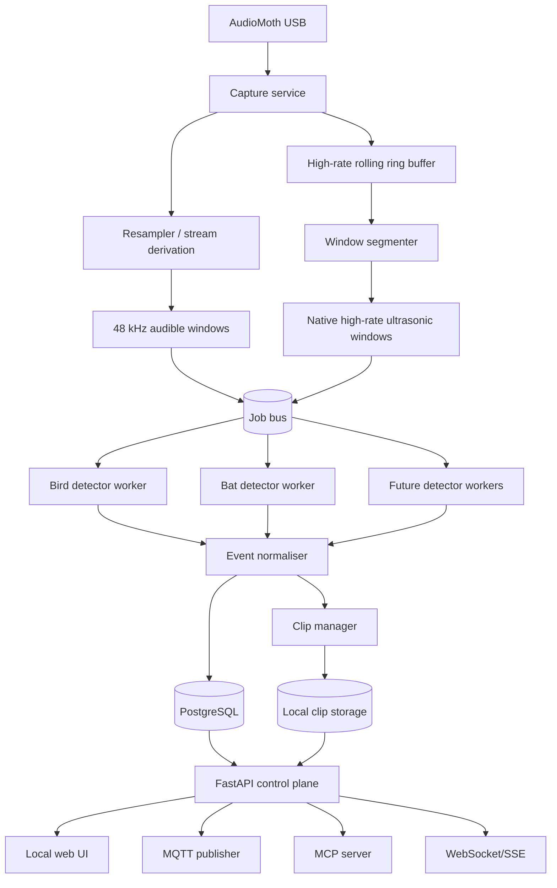

# Technical Specification

> **This is the seed specification, written before any code existed, and it is
> deliberately unedited.** It describes the intended architecture, not the
> deployed one. Substantial parts of it have not been built, and several were
> replaced on purpose.
>
> **Read [`ADRS.md`](ADRS.md) alongside it.** It indexes every deviation, one file
> per decision under [`adr/`](adr/), and each is recorded
> numbered, with the reasoning and what would have to be true to go back.
> [`GAP_REPORT.md`](GAP_REPORT.md) records what was uncertain before hardware
> existed and how each item resolved.
>
> The largest divergences, as of 2026-08-29:
>
> | This spec says | What actually runs | Why |
> |---|---|---|
> | §3 Docker Compose, eleven services | **two** `systemd` units, two processes, one venv — the station, plus the nightly timer-driven refinement runner | [[ADR-008 - systemd, not Compose|ADR-008]], [[ADR-045 - Refinement runner|ADR-045]] |
> | §3, §8 PostgreSQL 16 canonical | SQLite; PostgreSQL never exercised | [[ADR-007 - SQLite in developer mode|ADR-007]] |
> | §3, §15 Redis Streams job bus | in-process `EventBus` behind the same protocol | [[ADR-009 - In-process event bus|ADR-009]], and an explicit permission in `CLAUDE.md` |
> | §2 `bat-worker`: BatDetect2 | `ultrasonic-pass-v1`, a non-ML pass detector that claims no species. BatDetect2 measured at 0.52× realtime and not adopted | [[ADR-013 - ultrasonic-pass-v1|ADR-013]], [[ADR-017 - BatDetect2 as an optional adapter|ADR-017]] |
> | §2 `WebSocket/SSE` | WebSocket only; no SSE endpoint exists or is planned. Live listening additionally moved to a chunked-WAV HTTP stream | [[ADR-012 - One writer per WebSocket|ADR-012]], [[ADR-019 - Chunked-WAV live playback|ADR-019]] |
> | §2 MCP server | not implemented; no MCP code exists in this repository | Milestone 7, not started |
> | §9 anonymous read disabled by default | authentication exists but is **off by default**, with three deliberately credential-free paths | [[ADR-015 - Anonymous read, auth deferred|ADR-015]] → [[ADR-034 - Authentication foundation|ADR-034]] |
> | §6 orchestrator as a separate service | one process; the service boundaries are kept in code, communicating only through the bus and window references | [[ADR-008 - systemd, not Compose|ADR-008]] |
>
> §14's performance budgets are engineering targets, not measurements. The
> measurements are in
> [`../operations/TARGET_DIAGNOSTICS.md`](../operations/TARGET_DIAGNOSTICS.md).

## 1. Context

Open Observatory runs on a Raspberry Pi 5 connected to an AudioMoth USB Microphone. AudioMoth USB Microphone firmware supports operation as a Linux USB audio source at sample rates up to 384 kHz. Actual formats must be enumerated and negotiated on the target device rather than assumed.

The system must permit simultaneous logical use by bird, bat and later classifiers. Linux applications must not each compete to open the ALSA hardware device. A dedicated capture service owns it and publishes time-addressed audio windows.

## 2. Top-level architecture



## 3. Deployment model

Initial deployment uses Docker Compose, with the host providing ALSA device access and persistent SSD-backed volumes.

Recommended services:

- `capture`: privileged only as narrowly required for `/dev/snd`; owns microphone.
- `orchestrator`: converts capture manifests into detector jobs and enforces resource profiles.
- `bird-worker`: BirdNET adapter.
- `bat-worker`: BatDetect2 adapter.
- `normaliser`: validates and persists detector results.
- `api`: FastAPI control plane.
- `web`: static React application served by reverse proxy or API.
- `postgres`: canonical metadata and configuration.
- `redis`: job/event stream and ephemeral state.
- `mosquitto`: optional local broker; external broker may be configured instead.
- `prometheus`: optional but recommended.
- `grafana`: optional operations dashboard; product UI must not depend on it.

A single-process developer mode may combine orchestrator, normaliser and API, but production contracts remain message-based.

## 4. Audio capture design

### 4.1 Device discovery

Provide `oo audio probe` which records:

- ALSA card/device identifiers;
- USB vendor/product/serial where available;
- supported PCM formats;
- supported sample rates;
- channel counts;
- period/buffer limits;
- selected stable udev symlink;
- firmware/configuration notes entered by user.

Never rely solely on `hw:1,0`, as card numbering is unstable.

### 4.2 Negotiation

Preferred native capture profiles in order:

1. 384,000 Hz, mono, signed integer PCM supported by device;
2. 256,000 Hz;
3. 192,000 Hz;
4. highest available rate that supports target ultrasonic detector;
5. 48,000 Hz audible-only degraded mode.

Record selected rate, format and gain-related device settings in station state.

### 4.3 Authoritative clocking

Each capture block has:

- `stream_id` UUID;
- monotonic start/end nanoseconds;
- UTC start/end timestamps derived through a clock correlation sample;
- first frame sequence;
- frame count;
- negotiated sample rate and format;
- discontinuity flag/reason;
- checksum where persisted.

Monotonic time defines ordering and duration. UTC is presentation and correlation time. NTP clock steps must not reorder frames.

### 4.4 Buffering

Use an in-memory ring buffer sized by seconds, not byte constants. At 384 kHz, mono 16-bit PCM, 120 seconds is approximately 92 MB. Allow a memory-mapped SSD spill buffer only if evidence extraction cannot meet latency requirements.

Do not continuously write all PCM to disk by default.

### 4.5 Derived streams

The resampler reads authoritative high-rate blocks and creates deterministic audible blocks:

- 48,000 Hz;
- mono;
- signed 16-bit or float32 according to detector adapter;
- anti-alias low-pass filter;
- frame-to-source mapping retained.

Use high-quality polyphase resampling through libsoxr/FFmpeg/GStreamer. Test impulse and timestamp alignment.

### 4.6 Windowing

A `WindowSpec` contains:

- stream kind (`native`, `audible48`, future variants);
- requested sample rate;
- window duration;
- stride;
- overlap;
- encoding;
- maximum delivery latency;
- priority;
- night/day schedule constraints.

The segmenter creates immutable window references. Large PCM payloads should be passed by local file/shared-memory reference, not Redis message bodies.

## 5. Detector plugin contract

Each detector adapter must expose:

```python
class DetectorPlugin(Protocol):
    metadata: DetectorMetadata
    window_spec: WindowSpec

    async def initialise(self, context: DetectorContext) -> None: ...
    async def analyse(self, window: AudioWindow) -> list[NativeDetection]: ...
    async def health(self) -> DetectorHealth: ...
    async def shutdown(self) -> None: ...
```

`DetectorMetadata` includes:

- plugin ID and version;
- model ID/version/hash;
- taxonomy/label set version;
- licence name and attribution URL/text;
- supported architectures;
- required stream properties;
- estimated resource class;
- whether confidence calibration is known;
- external network behaviour, expected to be `none` by default.

The plugin returns native detections. The normaliser maps them to canonical detections while preserving the complete original result JSON.

## 6. Resource scheduling

Pi 5 resources are finite. The orchestrator must support:

- detector concurrency limits;
- per-worker CPU affinity optional;
- real-time versus deferred jobs;
- bounded queues;
- dropping or deferring policies by priority;
- day/night profiles;
- lag metric defined as `now - window_end`;
- circuit breaker after repeated failures;
- model warm/cold lifecycle configuration.

Initial policy:

- capture and resampling always win;
- bird detection is near-real-time throughout the day;
- bat detection is enabled from civil dusk to civil dawn plus configurable margins;
- generic/future detectors default to deferred or sampled operation;
- never allow detector load to create capture overruns.

## 7. Evidence clips

A detection may request an evidence clip. Clip manager:

1. combines configured pre-roll, detection interval and post-roll;
2. fetches source frames from the ring buffer;
3. writes a WAV or FLAC atomically;
4. calculates SHA-256;
5. records source stream/frame boundaries;
6. applies retention policy;
7. optionally creates a lower-rate playback derivative while preserving an ultrasonic source clip for bat review.

Defaults:

- bird clip: 3 seconds pre-roll, event, 3 seconds post-roll, max 12 seconds;
- bat clip: native-rate event context, initially max 5 seconds;
- duplicate/overlapping clips may be coalesced but detection-to-clip relationships remain many-to-many.

## 8. Persistence

PostgreSQL is canonical for configuration, health events, detections, reviews, telemetry references and asset metadata. Filesystem/SSD is canonical for clip bytes. Redis is not durable product state.

Use Alembic migrations and immutable event timestamps. See [[DATA_MODEL]].

## 9. APIs and authentication

Default binding is LAN-only. First release supports:

- anonymous read access disabled by default;
- local administrator account or reverse-proxy trusted authentication;
- API tokens with scopes for integrations;
- CSRF protection for browser writes;
- no direct internet exposure recommendation;
- secrets held in Docker secrets or root-readable environment files, never UI-exported.

MCP is read-only in v1 except for acknowledgement/review actions, which require an explicit write-capable token.

## 10. MQTT and Home Assistant

Publish normalised events, not raw PCM. Use retained state topics for station health and non-retained topics for detections. Home Assistant discovery creates sensors for station status, species today, last detection, capture continuity, disk free and detector health.

Environmental telemetry is ingested through configured MQTT topic mappings. Home Assistant remains the likely source of weather/light measurements; Open Observatory correlates rather than owns those sensors.

## 11. Observability

### Metrics

- captured frames total;
- capture overruns/discontinuities;
- audio RMS/peak/clipping ratio;
- ring-buffer fill and extraction misses;
- resampler processing duration;
- detector job queue depth;
- detector latency and failure counts;
- detections by model/label;
- clip writes/failures/storage;
- CPU temperature, throttling, load and memory;
- database and Redis health.

### Logs

JSON structured logs with service, event type, stream/window/job/detection IDs and exception chain. Avoid logging paths containing secrets or raw transcription.

### Traces

Trace a window from capture manifest through detector and persistence. Sample successful high-volume traces; retain errors.

## 12. Failure behaviour

- Microphone disconnect: close stream, log discontinuity, back off and reprobe; resume with a new `stream_id`.
- Detector crash: continue capture, restart worker, retry bounded jobs if window audio remains available.
- Database unavailable: continue bounded capture/detection buffering; degrade visibly; never allow unbounded disk growth.
- Redis unavailable: continue capture; pause scheduling; health state critical.
- Disk full: stop creating clips before database corruption; continue metadata where possible; raise critical alert.
- Thermal throttling: reduce/defer lower-priority detectors.
- Clock change: emit clock-correlation event; maintain monotonic continuity.

## 13. Security

- Minimise container privileges.
- Mount audio device only into capture service.
- Read-only root filesystems where feasible.
- Dependency and image vulnerability scanning in CI.
- Signed/checksummed model acquisition manifest.
- Explicit outbound-network allowlist per integration service.
- Model licences and hashes displayed in product UI.
- Sanitise uploaded/replayed filenames and all detector-native metadata before rendering.

## 14. Performance budgets

Initial target budgets, to be validated:

- capture CPU: under 10% of one Pi 5 core average;
- resampling CPU: under 25% of one core average;
- capture-to-window scheduling latency: under 1 second;
- ring-buffer extraction miss: zero under supported profile;
- total sustained memory: under 6 GB on an 8 GB Pi, under 3 GB profile available for 4 GB Pi;
- UI/API p95 query: under 500 ms for ordinary 24-hour views;
- detector lag: bird p95 under 15 seconds; bat p95 under 60 seconds in real-time profile.

These are engineering targets, not claims about third-party model performance.

## 15. Technology decisions

### Python version

Start with Python 3.12 rather than 3.13 to reduce ARM dependency friction. Upgrade after detector compatibility is proven.

### PostgreSQL versus SQLite

Use PostgreSQL because concurrent workers, reviews, telemetry and retention tasks are core. A future lite profile may use SQLite, but is not a v1 requirement.

### Redis Streams

Use Redis Streams for bounded job/event delivery and consumer groups. Store large audio windows in tmpfs/shared filesystem with leases. Redis contains references only.

### Why not PipeWire as the architectural bus

PipeWire can duplicate a live device stream, but it does not provide the immutable, time-addressed, retryable window semantics required by asynchronous classifiers and evidence extraction. It may be used below capture for device management, not as the detector contract.
